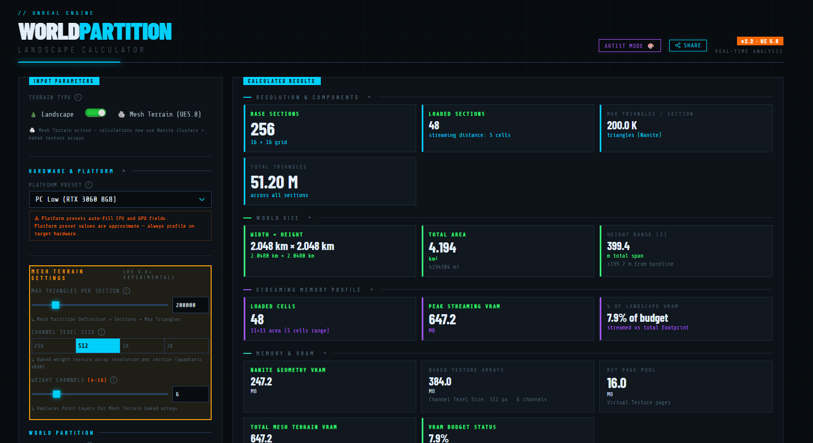
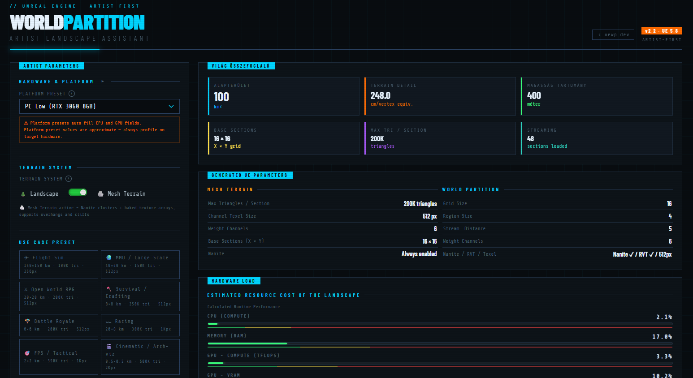

# UE5 World Partition Landscape Calculator

> **Live site:** [uewp.dev](https://uewp.dev)

A real-time, browser-based technical calculator for **Unreal Engine 5 World Partition Landscape** planning. No installation, no backend — everything runs client-side in a single HTML page.

---

## What is this?

When designing large open-world landscapes in Unreal Engine 5, you need to balance dozens of interdependent parameters: landscape resolution, component counts, streaming cell sizes, HLOD regions, texture memory (heightmaps, weightmaps), RVT page pools, collision geometry, hardware budgets, and more. Getting these wrong early on causes painful rework later.

**uewp.dev** gives you instant, real-time feedback on all of these metrics as you tweak parameters — before you ever open the engine.

---

## Features

### Configurator (`index.html`)

- **Platform Presets** — One-click hardware profiles (PC, console, mobile) that auto-fill CPU/GPU/RAM fields
- **World Partition grid** — Configure streaming cell grid size, region size and streaming distance
- **Landscape scale & components** — X/Y/Z scale, section size, sections-per-component, quick presets (4×4 → 128×128)
- **Bit Depth Settings** — Heightmap (8/16/32-bit) and Weightmap (8/16/32-bit) with comparison tables showing precision and total sizes
- **Runtime Virtual Texture (RVT)** — Enable/disable, configure resolution, layer count and page pool, with a Weightmap vs. RVT VRAM comparison table
- **Nanite Landscape & VSM** — Toggle flags with budget impact warnings
- **Collision modes** — Simple / Complex / Per-Poly with memory cost output
- **Paint Layers** — Material budget input driving weightmap calculations

#### Calculated Results
| Section | What you get |
|---|---|
| Resolution & Components | Total vertices, component count, landscape resolution in pixels |
| World Size | Physical world size in meters/kilometers |
| Streaming Memory Profile | Active cell count, data loaded per streaming state |
| Memory & VRAM | Heightmap + Weightmap sizes across all bit depths, per-WP-cell and per-HLOD-region breakdown |
| Collision Memory | RAM cost per collision mode |
| World Partition Streaming | Cell counts, view distance table with LOD/HLOD transition distances |
| Resource Budget | CPU, RAM, GPU TFLOPs and VRAM usage bars against hardware targets |
| Cook / Import Time Estimator | Approximate editor import and cook time for the configured landscape |
| Point Density | Vertices per m², useful for foliage and scatter planning |
| Geometry | Total triangle count and draw-call estimates |
| RVT VRAM | Page pool usage with approach comparison table |
| LayerInfo & Weightmap Textures | Texture count, dimensions, and memory per layer |
| Diagnostics | Live warning panel (Nanite+VSM conflicts, oversized configs, budget overruns, etc.) |
| Streaming Grid Preview | Interactive canvas visualizing landscape components, WP cells and HLOD regions |

### Artist Mode (`artist.html`)

A streamlined, artist-friendly view that exposes only the most relevant parameters for landscape artists — without overwhelming technical detail. Includes a **Share Artist Link** button that encodes the entire configuration into the URL hash, so specs can be sent directly to a technical director or artist without any manual copy-paste.

---

## Screenshots

---

## Technology

- Pure **HTML5 / CSS3 / Vanilla JavaScript** — no frameworks, no dependencies, no build step
- URL hash-based state sharing (Base64 encoded config)

---

## Status

| Version | UE Target | Status |
|---|---|---|
| v2.1 | UE 5.7 | ✅ Live |

---

## Legal

- **Generated data** (calculation outputs) → [CC0 1.0 Public Domain](https://creativecommons.org/publicdomain/zero/1.0/)
- **Website, design, code, UI** → © 2026 Chery / uewp.dev — All rights reserved
- Not affiliated with Epic Games, Inc. "Unreal Engine" is a trademark of Epic Games, Inc.

See [LICENSE](LICENSE) for full details.

---

## Source Code

The source code is **not published** in this repository. This repo exists for changelog, legal documentation and public reference purposes only.

If you have questions or feedback, open an [issue](../../issues).

